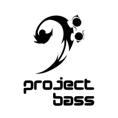

<div align="center">
    <picture>
        <source srcset="assets/logo/dark-mode/project-bass.png"  media="(prefers-color-scheme: dark)">
        
    </picture>
</div>

[](https://github.com/copier-org/copier)
[](https://img.shields.io/github/commit-activity/m/stepmanai/project-bass)
[](https://img.shields.io/github/license/stepmanai/project-bass)

A Copier template designed to streamline the creation process of new Stepman.AI projects.

- **Github repository**: <https://github.com/stepmanai/project-bass/>

## Prerequisites:

Based on [Copier's installation requirements](https://github.com/copier-org/copier?tab=readme-ov-file#installation), this project is natively supported on `Ubuntu 22.04` (`ubuntu:jammy`) and later versions.

> **Note**: The following instructions assume you have access to this repository. If you need to request access, please contact us.

## Getting Started with Your Project

### 1. Clone the Repository to Your Local Environment

Begin by cloning the repository to a specific location on your local machine.

```bash
git clone https://github.com/stepmanai/project-bass.git
```

### 2. Install Required Local Dependencies

Next, install the necessary dependencies by following the [installation steps](https://github.com/copier-org/copier?tab=readme-ov-file#installation) in Copier's repository.

You are now ready to start development on your project!

## Usage

TODO: Insert usage steps.

---

Repository structure based on [fpgmaas/cookiecutter-uv](https://github.com/fpgmaas/cookiecutter-uv).
